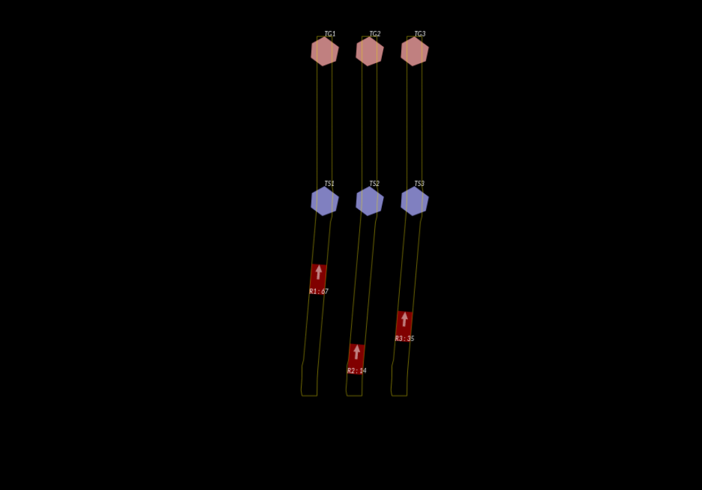
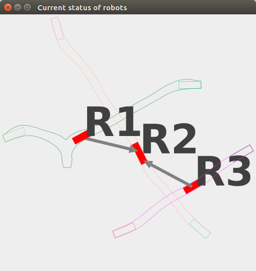

# A Framework for Multi-Robot Task Assignment


This software implements an _online task assignment method for multiple robots_. 


Its main features are:

* Goals can be posted and paths computed online
* Precedences are inferred online, accounting for robot dynamics via provided dynamic models
* Very few assumptions are made on robot controllers
* The coordination method is not specific to a particular motion planning technique

The software includes a basic 2D robot simulation and a simple built-in motion planner (which depends on the <a href="http://ompl.kavrakilab.org/">OMPL</a> and <a href="http://www.mrpt.org/">MRPT</a> libraries). A <a href="https://github.com/FedericoPecora/coordination_oru_ros">separate interface package</a> is provided to enable the use of this software in conjunction with <a href="http://www.ros.org/">ROS</a> and the <a href="https://github.com/OrebroUniversity/navigation_oru-release">navigation_oru</a> stack to obtain a fully implemented stack for multi-robot coordination and motion planning.

## Overview
The algorithm provided by this implementation is detailed in


* Paolo Forte, Anna Mannucci, Henrik Andreasson and Federico Pecora, <a href="https://ieeexplore.ieee.org/abstract/document/9387084"> "Online Task Assignment and Coordination in Multi-Robot Fleets </a>," in IEEE Robotics and Automation Letters, vol. 6, no. 3, pp. 4584-4591, July 2021, doi: 10.1109/LRA.2021.3068918.


[](https://www.youtube.com/watch?v=HCi1M1h7TCE "Examples usages of the assignment_oru library")

This system propose a loosely-coupled framework for integrated task assignment, motion planning, coordination and control of heterogeneous fleets of robots subject to non-cooperative tasks. The approach accounts for the important real-world requirement that tasks can be posted asynchronously. The systematic algorithm exploits systematic search for optimal task assignment, where interference is considered as a cost and estimated with knowledge of the kinodynamic models and current state of the robots. Safety is guaranteed by an online coordination algorithm, where the absence of collisions is treated as a hard constraint. The relation between the weight of interference cost in task assignment and computational overhead is analyzed empirically, and the approach is compared against alternative realizations using local search algorithms for task assignment.


## Installation

To install the coordination framework, follow the instruction provided <a href="https://github.com/PaoloForte95/coordination_oru/tree/devel">here</a>. Note that the branch devel is the one to install. 

To install the navigation framework, follow the instruction provided <a href="https://github.com/OrebroUniversity/navigation_oru-release">here</a>

To install the fleetmaster library, follow the instruction provided <a href="https://gitsvn-nt.oru.se/hkan/fleetmaster.git">here</a>. This one is used to evaluate the delay time to complete a mission related to intereference among robots. After build fleetmaster, copy the shared library libfleetmaster.so into the FleetMasterInterface folder. 


To install the assignment framework, clone this repository and compile the source code with gradle (redistributable included):

```
$ git clone https://github.com/PaoloForte95/assignment_oru.git
$ cd assignment_oru
$ ./gradlew install eclipse

```


## Running an example
A number of examples are provided. Issue the following command from the source code root directory for instructions on how to run the examples:
```
$ ./gradlew run
```
In the example ```TestTrajectoryEnvelopeCoordinatorThreeRobots```, missions are continuously posted for three robots to reach locations along intersecting paths. The paths are stored in files provided in the ```paths``` directory. The poses of locations and pointers to relevant path files between locations are stored in the self-explanatory ```paths/test_poses_and_path_data.txt``` file.

## Visualizations
The API provides three visualization methods:

* ```BrowserTaskVisualization```: a browser-based visualization.
* ```JTSDrawingPanelTaskVisualization```: a Swing-based visualization.
* ```RVizTaskVisualization```: a visualization based on the ROS visualization tool <a href="http://wiki.ros.org/rviz">RViz</a>.

All three visualizations implement the abstract ```TaskFleetVisualization``` class, which can be used as a basis to create your own visualization.

Most examples use the ```BrowserTaskVisualization```. The state of the fleet can be viewed from a browser at <a href="http://localhost:8080">http://localhost:8080</a>. The image below shows this visualization for the ```TaskAssignmentWithoutMap``` example:



An arrow between two robots indicates that the source robot will yield to the target robot. Priorities are computed based on a heuristic (which can be provided by the user) and a forward model of robot dynamics (which can also be provided, and is assumed to be conservative - see the <a href="http://iliad-project.eu/wp-content/uploads/papers/PecoraEtAlICAPS2018.pdf">ICAPS 2018 paper</a> mentioned above). The specific poses at which robots yield are also updated online, based on the current positions of robots and the intersecting areas of their trajectory envelopes (critical sections). This makes it possible to achieve "following" behavior, that is, the yielding pose of a robot is updated online while the "leading" robot drives.

The a Swing-based GUI provided by class ```JTSDrawingPanelVisualization``` looks like this:



This GUI allows to take screenshots in SVG, EPS and PDF formats by pressing the ```s```, ```e``` and ```p``` keys, respectively (while focus is on the GUI window). Screenshots are saved in files named with a timestamp, e.g., ```2017-08-13-11:13:17:528.svg```. Note that saving PDF and EPS files is computationally demanding and will temporarily interrupt the rendering of robot movements; SVG screenshots are saved much quicker.

The ```RVizVisualization``` visualization publishes <a href="http://wiki.ros.org/rviz/DisplayTypes/Marker">visualization markers</a> that can be visualized in <a href="http://wiki.ros.org/rviz">RViz</a>. The class also provides the static method ```writeRVizConfigFile(int ... robotIDs)``` for writing an appropriate RViz confiuration file for a given set of robots. An example of the visualization is shown below.


The visualization with least computational overhead is the ```RVizVisualization```, and is recommended for fleets of many robots. The ```BrowserVisualization``` class serves an HTML page with a Javascript which communicates with the coordinator via websockets. Although rendering in this solution is less efficient than in RViz, the rendering occurs on the client platform (where the browser is running), so its computational overhead does not necessarily affect the coordination algorithm. The ```JTSDrawingPanelVisualization``` is rather slow and not recommended for fleets of more than a handful of robots, however it is practical (not requiring to start another process/program for visualization) and relatively well-tested.


## Sponsors
This project is supported by

* The <a href="http://semanticrobots.oru.se">Semantic Robots</a> Research Profile, funded by the <a href="http://www.kks.se/">Swedish Knowledge Foundation</a>
* The <a href="https://iliad-project.eu/">ILIAD Project</a>, funded by the <a href="https://ec.europa.eu/programmes/horizon2020/">EC H2020 Program</a>
* The iQMobility Project, funded by <a href="https://www.vinnova.se/">Vinnova</a>

* The <a href="https://www.more-itn.eu/">MORE Project</a> Research Profile, funded by the European Union’s Horizon 2020 research and innovation programme under the Marie Skłodowska-Curie grant agreement. 

## License
assignment_oru - Robot-agnostic online task assignment for multiple robots

Copyright &copy; 2017-2021 Paolo Forte

This program is free software: you can redistribute it and/or modify it under the terms of the GNU General Public License as published by the Free Software Foundation, either version 3 of the License, or (at your option) any later version.

This program is distributed in the hope that it will be useful, but WITHOUT ANY WARRANTY; without even the implied warranty of MERCHANTABILITY or FITNESS FOR A PARTICULAR PURPOSE.  See the GNU General Public License for more details.

You should have received a copy of the GNU General Public License along with this program.  If not, see <http://www.gnu.org/licenses/>.
